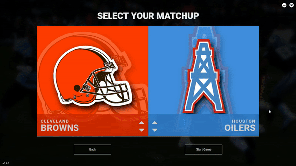

# Second Season Game Tracker

> A game tracker for Second Season Express Football by Plaay Games using Electron and Vue.

#### Features

- Full Express Game Tracker
- Drive and Scoring Summary
- Shareable Game Recaps
- Customizable Team Setup

#### Customizing Teams

 

- You can change team's abbreviation, city, mascot, color, and logo!
- Hitting RESET TEAMS will remove all custom teams and reset the teams to the original 32 NFL teams.
- Once you enter team details, hitting back will sort teams into proper alphabetical order upon returning to main menu.

#### Starting New Game

 

- The home team is always defaulted to your favorite team which is selectable in settings menu.
- The away team is always a randomly selected team to start.
- Clicking start game will overwrite any game that was in progress.

#### Coin Toss

- Away team always calls the coin toss.
- Teams that win the coin toss automatically defer.
- Team that wins the coin toss will get the ball at halftime.

#### Playing the Game

 

- Select your play type to choose how many zones the game tells you occured.
- Cancel option is available in all play calls for accidental key presses.
- After scores, halftime, overtime, etc. the ball always gets placed in the left endzone.
- For thematic play, on touchdown plays, choose exact amount of zones away. 
- Fumbles and interceptions are always done with the turnover button.
- Fumbles that are after gain, make sure to use fumble (after gain).
- For auto playcalling, use the GET PLAY button to get random playcall and the value for the player finder.

#### Shareable Game Recaps

 

- After game completion, click view recap and download to save to your PC. 
- After save, if the recap does not open, make sure to add .JPEG to the end of your file name.
- If you accidently close out of the end game menu, back out to main menu and click continue game.

#### Known Bugs

- Drive Summary/Scoring Summary cannot display :30 timing.
- Quarter by Quarter scoring does not save if you exit and continue game later.
- Ball always is placed in the left endzone despite the scoring team.
